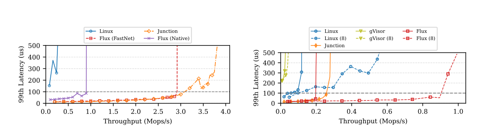
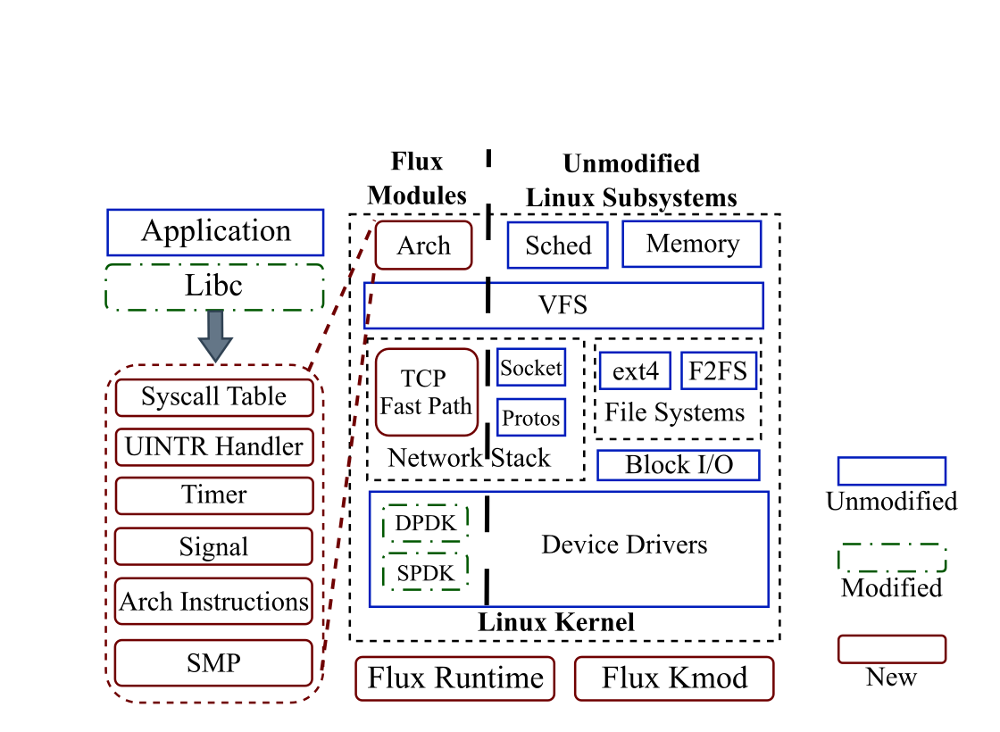
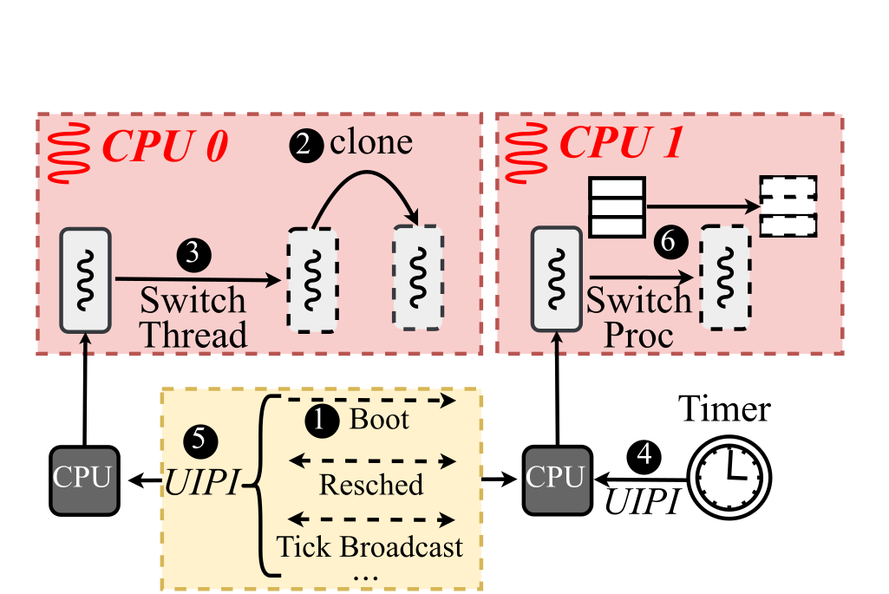
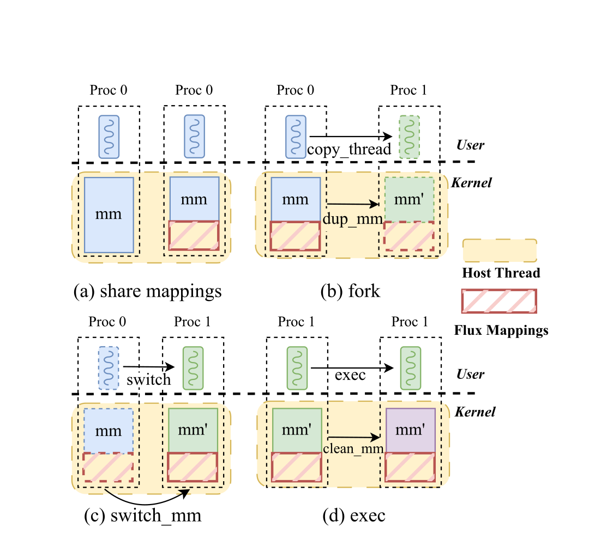

# Flux

<p align="center">
  <strong>Turning Linux into a High-Performance Library OS</strong><br>
  <sub>Direct-call syscalls · single-level scheduling · hardware preemption · Linux fork semantics</sub>
</p>

<p align="center">
  <a href="https://doi.org/10.1145/3830418.3843881">SOSP '26 paper</a>
  ·
  <a href="#quick-start">Quick start</a>
  ·
  <a href="#citation">Citation</a>
</p>

<p align="center">
  <a href="./docs/assets/flux-demo.mp4">
    
  </a>
</p>

<p align="center"><sub>13-second real terminal recording · click the preview for the full-resolution video</sub></p>

Flux is a Linux-based library OS that runs applications and the Linux kernel together in user space. It keeps mature Linux subsystems largely intact, but replaces the surrounding runtime paths that make conventional Linux-based library OSes slow.

Flux is a **userspace LibOS, not a VM**. Applications enter Linux syscall handlers through direct function calls; Flux schedules its own threads, uses Intel User Interrupts (UINTR) for timers and IPIs, and supports page-table-isolated processes with copy-on-write fork.

## Highlights

| Compatibility | Latency-sensitive services | Storage | Scheduling |
|---|---|---|---|
| **92.2%** LTP pass rate across 2,563 cases | Up to **18.5×** Linux Nginx throughput under a 100 µs p99 target | Up to **47%** higher ext4 Filebench throughput than Linux | **3×** faster than Linux on hackbench |

Flux also comes within **4% of Junction's Memcached throughput** under the same 100 µs p99 latency target, while retaining Linux subsystems and full fork-based multi-process execution.

> These numbers are results from the SOSP '26 evaluation environment. See the paper for workload definitions, hardware, baselines, and methodology.

<p align="center">
  
</p>

<p align="center"><sub>Paper Figures 7 and 8: Memcached and Nginx throughput under tail-latency constraints.</sub></p>

## Design

Flux keeps the Linux surface that applications expect and redesigns the runtime around it. The architecture has three main additions: architecture-specific fast paths, kernel-bypass I/O, and a small host bridge for privileged operations.

The figures in this section are reproduced directly from the SOSP '26 paper, which is published under CC BY 4.0.

<p align="center">
  
</p>

### Scheduling and multi-process support

<table>
  <tr>
    <th width="50%">Single-level scheduling</th>
    <th width="50%">Linux multi-process semantics</th>
  </tr>
  <tr>
    <td align="center" valign="middle">
      
    </td>
    <td align="center" valign="middle">
      
    </td>
  </tr>
  <tr>
    <td valign="top"><sub>Each pinned host thread bootstraps one Flux CPU. The Linux scheduler inside Flux owns task selection, wakeups, preemption, and context switches; UINTR delivers timers and cross-core IPIs.</sub></td>
    <td valign="top"><sub>Flux keeps application mappings private and Flux mappings shared. A lightweight host module performs privileged page-table operations for copy-on-write <code>fork</code>, <code>switch_mm</code>, and <code>exec</code>.</sub></td>
  </tr>
</table>

### Fast paths without a new operating-system API

- **Direct-call syscalls:** applications use the Linux syscall interface without a host-kernel trap on the common path.
- **Hardware preemption:** UINTR provides low-latency timers and IPIs for multicore Linux scheduling in user space.
- **Kernel-bypass I/O:** DPDK, SPDK, and an optional TCP fast path reduce networking and storage overhead.
- **Linux reuse:** the scheduler, VFS, memory management, sockets, filesystems, and most device-driver code remain Linux.
- **Process compatibility:** `fork`, `clone`, `exec`, `wait`, signals, and copy-on-write address spaces support unmodified multi-process applications such as Nginx and Redis.

## Repository layout

| Path | Purpose |
|---|---|
| `flux/` | Userspace runtime, host bridge, I/O paths, `flux-iokd`, and OCI runtime |
| `kernel/` | Linux 6.6-based Flux kernel and architecture port |
| `kmod/` | Small host module for UINTR, memory, and privileged address-space operations |
| `configs/` | Example Flux and `flux-iokd` configurations |
| `scripts/` | Build helpers, compatibility patch workflow, and device setup |
| `third-party/` | DPDK, SPDK, RDMA, and optional glibc submodules |

## Requirements

The evaluated fast path targets Intel x86-64 systems with:

- Intel UINTR support for low-latency timer and IPI delivery;
- Memory Protection Keys (MPK) for in-address-space isolation;
- a Linux host able to build and load the Flux kernel module;
- DPDK/RDMA-capable networking and SPDK-capable NVMe devices for the corresponding kernel-bypass configurations.

The paper discusses host-mediated interrupt delivery as a fallback when UINTR is unavailable, but it adds host transitions and is not the evaluated fast path. Other architectures require equivalents to UINTR and MPK.

## Quick start

### 1. Fetch dependencies

```bash
git submodule update --init --recursive
```

Build RDMA/DPDK for the paper's network datapath, and SPDK when needed:

```bash
./scripts/build.sh rdma
./scripts/build.sh dpdk
./scripts/build.sh spdk   # optional
```

### 2. Build Flux

The repository carries the ordered Linux compatibility patches and applies them transactionally for a build:

```bash
scripts/flux-kernel-patches.sh check
scripts/flux-kernel-patches.sh run -- \
  make -j"$(nproc)" KCONFIG=linux66_compat_defconfig \
    SMP=1 MAX_CPUS=4 MPK=1 FNET=0 FAST_NET=0 SPDK=0 RUNC=1
```

For the DPDK network fast path used in the paper:

```bash
scripts/flux-kernel-patches.sh run -- \
  make -j"$(nproc)" KCONFIG=linux66_compat_defconfig \
    SMP=1 MAX_CPUS=4 MPK=1 FNET=1 FAST_NET=1 SPDK=0 RUNC=1
```

Generated binaries are written to `build/`:

```text
build/flux
build/flux-iokd
build/flux-runc
```

### 3. Load the host module

```bash
make -C kmod
sudo make -C kmod insmod
```

This creates `/dev/flux`, `/dev/flux_uintr`, and `/dev/flux_mm`.

### 4. Run an application

Start `flux-iokd` with a configuration matching the host's CPU and device setup, then launch an existing Linux binary:

```bash
./build/flux-iokd -c configs/config_iokd.json
./build/flux -c configs/config.json -- /bin/echo "hello from Flux"
```

Flux also provides `flux-runc`, an OCI runtime entry point used by the Docker demo above. It supports container lifecycle operations, interactive TTYs, `exec`, signals, resource updates, and runtime statistics while executing the workload inside Flux rather than falling back to native `runc`.

## Configuration

Important build options:

| Option | Meaning |
|---|---|
| `SMP=1 MAX_CPUS=N` | Build a multicore Flux runtime with up to `N` Flux CPUs |
| `FNET=1 FAST_NET=1` | Enable DPDK integration and the TCP fast path |
| `SPDK=1` | Enable the SPDK storage path |
| `RUNC=1` | Build the OCI runtime entry point |
| `MPK=1` | Enable MPK isolation |

Runtime JSON controls memory size, CPU placement, environment, host mounts, loader selection, `flux-iokd` connectivity, and optional network/storage settings. See `configs/` for starting points.

## Paper

**Turning Linux into a High-Performance Library OS with Flux**<br>
Kaifu Tian, Youjie Zheng, Yiren Zhang, Yuyang You, Keyang Hu, Kang Chen, and Yu Chen<br>
ACM SIGOPS 32nd Symposium on Operating Systems Principles (SOSP '26), Prague, Czech Republic<br>
[https://doi.org/10.1145/3830418.3843881](https://doi.org/10.1145/3830418.3843881)

## Citation

```bibtex
@inproceedings{tian2026flux,
  author    = {Kaifu Tian and Youjie Zheng and Yiren Zhang and
               Yuyang You and Keyang Hu and Kang Chen and Yu Chen},
  title     = {Turning Linux into a High-Performance Library OS with Flux},
  booktitle = {Proceedings of the ACM SIGOPS 32nd Symposium on
               Operating Systems Principles},
  series    = {SOSP '26},
  year      = {2026},
  isbn      = {979-8-4007-2585-2},
  numpages  = {17},
  publisher = {Association for Computing Machinery},
  address   = {New York, NY, USA},
  location  = {Prague, Czech Republic},
  doi       = {10.1145/3830418.3843881},
  url       = {https://doi.org/10.1145/3830418.3843881}
}
```
